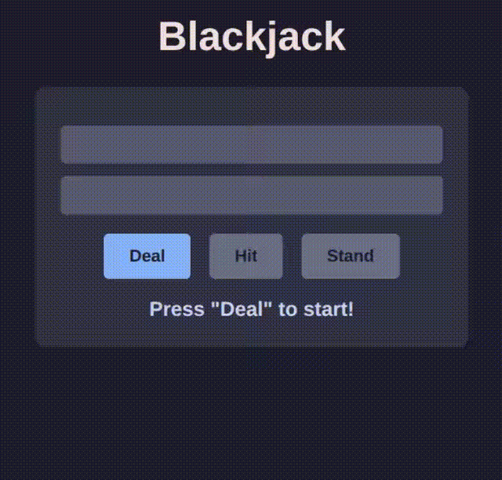

# 🃏 Blackjack Browser Game

 [](https://nodejs.org/)

A simple browser-based Blackjack game built with Node.js and Express.

## 🎥 Screencast



## ✨ Features

- 🎲 Play Blackjack in your browser
- 🃍 Dealer and player hands with real-time value display
- 🎨 Catppuccin Mocha color theme
- 🕹️ Animations for dealing cards
- 🧠 Tracks hand values to help learn the game
- 🔒 Session-based state management
- ✨ Basic highlighting for new cards drawn
- ⌨️ Keyboard controls
- 👑 Crown emoji to showcase the winner

## 🚀 How to Run

1. **Install dependencies:**

   ```bash
   npm install
   ```
2. **Start the server:**
   ```bash
   node server.js
   ```
3. **Open your browser:**

   Visit http://localhost:3000 to start playing.
4. **Play!**

   Use buttons to play, or press `D` to deal, `H` to hit, or `S` to stand.


## 🛠️ Development notes
- ⚙️ Backend: Node.js + Express with session support
- 🎨 Frontend: Vanilla JS + CSS
- 🃏 Cards are displayed using simple Unicode symbols for suits
- 🔀 Deck is shuffled using Fisher-Yates algorithm
- 🗂️ Session persists game state between requests

## Ideas to add
- 💰 Add betting and scoring

## 📄 License
MIT License